**This is a fun NFT project where math ❤️ can own matrix and multiply them.**

# Linear Algebra NFT

In linear algebra, linear transformations are usually represented by matrices.

And matrices are also commonly used math objects in many fields like Physics, Engineering, Economics, Computer Sciences as well as Blockchain and Metaverse applications.

## 3x3 matrix over *GF(3)*

There are $3^9$ (19683) such matrices:

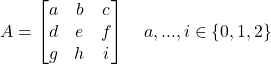

And each of them represent a unique linear transformation in the 3-dimensional vector space over *GF(3)*.

## NFT

We created a NFT with 19683 assets corresponding to the 19683 matrices.

Every matrix can be owned by a different math ❤️.

## Digital Assets

Numbers are tedious so we represent *{0, 1, 2}* as  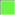 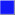.

### Addition rules

1.  +  = 
2.  +  = 
3.  +  = 
4.  +  = 
5.  +  = 
6.  +  = 
7.  +  = 
8.  +  = 
9.  +  = 

### Multiplication rules

1.  x  = 
2.  x  = 
3.  x  = 
4.  x  = 
5.  x  = 
6.  x  = 
7.  x  = 
8.  x  = 
9.  x  = 

### Pre-generated images

All 19683 assets images are pre-generated [/images/*.png](/images/).

### Example

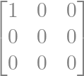 is 

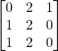 is 

## Asset Index

Every digital asset (matrix) has a unique index.

It is base3-encoding through out all elements (row-wise).

### Example

 is `#1`
 
 is `#5307` 

## Addition

Two digital assets can be added together.

### Example

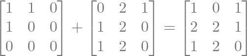

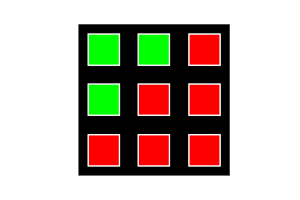 +  = 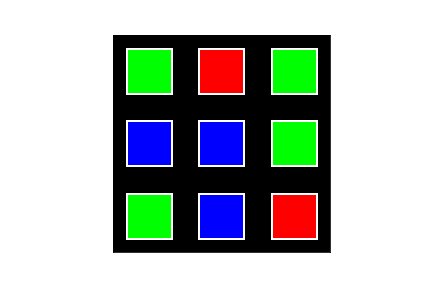

## Multiplication

Two digital assets can be multiplied to generate a 3rd asset. 

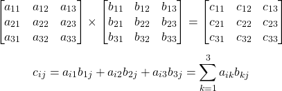

### Example

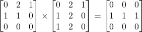

is equivalent to 

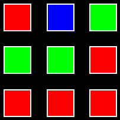 x  = 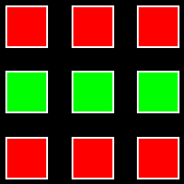

## Rarity

There are many traits like matrix `trace`, `determint`, `eigenvalue` or just the color pattern, but one interesting way to define rarity is how many other matrices could be generated by multiplication from a given set.

### Example

`{#999, #18888}` can only generate 449 matrices.

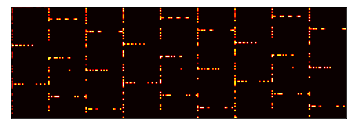

But `{#123, #5000}` can generate 8464 matrices on the other hand.

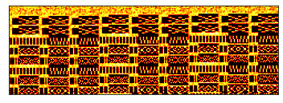

## Mint

When you own two assets, you could multiply them to acquire the resulted asset in compliance with following rules:

1. Resulted asset is NOT minted yet. 
2. Lock `0.01 ETH` multiplication fee into the pool.

## Airdrop

At the beginning, a few genesis assets are initialized by airdrop (whitelist).

These genesis matrices are guaranteed to be able to trans-generate all the 19683 assets.

## Goal

The goal is to unlock all 19683 assets by the community.

When the goal is reached:

1. All locked multiplication fees (in the pool) will be returned to the current owners.
2. A special price (`100 ETH`) will be granted to the owners of some rare matrices. (Details to be revealed)

## Transfer

You can trade your assets (like other NFTs) anytime on any platform. 