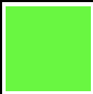
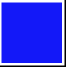
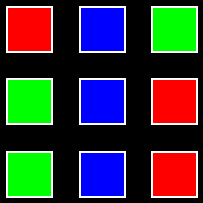

**This is a fun NFT project where math ❤️ can own matrix and multiply them.**

# Linear Algebra NFT

In linear algebra, linear transformations are usually represented by matrices.

And matrices are also commonly used math objects in many fields like Physics, Engineering, Economics, Computer Sciences as well as Blockchain and Metaverse applications.

## 3x3 matrix over *GF(3)*

There are $3^9$ (19683) such matrices:

$$
A = 

\begin{bmatrix}
a & b & c \\
d & e & f \\
g & h & i
\end{bmatrix}

\quad a,...,i \in \{ 0, 1, 2 \}
$$

And each of them represent a unique linear transformation in the 3-dimensional vector space over *GF(3)*.

## NFT

We created a NFT with 19683 assets corresponding to the 19683 matrices.

Every matrix can be owned by a different math ❤️.

## Digital Assets

Numbers are tedious so we represent $\{0 , 1, 2 \}$ as

.

For example,
$
\begin{bmatrix}
1 & 0 & 0 \\
0 & 0 & 0 \\
0 & 0 & 0
\end{bmatrix}
$ is

And
$
\begin{bmatrix}
0 & 2 & 1 \\
1 & 2 & 0 \\
1 & 2 & 0
\end{bmatrix}
$ is

